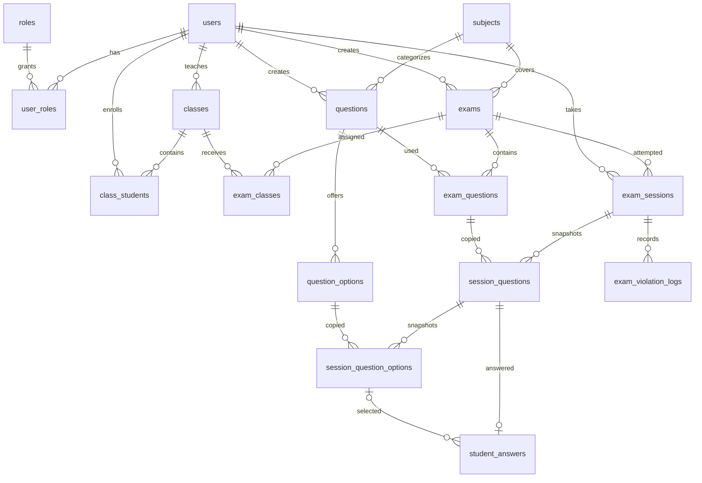

# Thiết kế database ExamGuard

Task T03 trên branch `feature/database-design` thiết kế dữ liệu cho quản lý người dùng, lớp học, môn học, ngân hàng câu hỏi và bài kiểm tra. Schema cũng chuẩn bị dữ liệu cho các task phiên thi, lưu đáp án, chấm điểm và ghi nhận vi phạm trong đề tài.

Backend dùng MySQL, Spring Data JPA và Lombok. Có 16 bảng, 13 entity và 3 bảng nối nhiều–nhiều. Task này chưa triển khai API, đăng nhập, chấm bài, Redis hoặc RabbitMQ.

## Khởi tạo database

Giữ kết nối MySQL trong `ExamGuardBE/src/main/resources/application.yaml`. Database `exam_guard` cần tồn tại trước khi chạy backend; tài khoản kết nối cần quyền tạo bảng và thêm role.

Chạy từ thư mục `ExamGuardBE`:

```powershell
.\mvnw.cmd spring-boot:run
```

Spring Boot chạy `src/main/resources/db/schema.sql` trước khi khởi tạo JPA, sau đó chạy `db/data.sql` để thêm ba role `ADMIN`, `TEACHER`, `STUDENT`. `CREATE TABLE IF NOT EXISTS` giữ bảng đã có; `INSERT IGNORE` bỏ qua role trùng khi khởi động lại. Dữ liệu mẫu nằm riêng trong `db/sample-data.sql`, được bật bằng profile `demo`. Không dùng Flyway.

Hibernate dùng `ddl-auto: validate` để phát hiện entity không khớp schema. Script khởi tạo chỉ tạo bảng còn thiếu, **không tự sửa cấu trúc bảng đã tồn tại**. Khi thay đổi thiết kế ở task tiếp theo, cần viết và chạy `ALTER TABLE` tương ứng trước khi chạy backend; không cần xóa database hoặc dữ liệu cũ.

## Dữ liệu mẫu

`src/main/resources/db/sample-data.sql` thêm **24 bản ghi cho mỗi bảng ngoài `roles`**, gồm cả bảng nối; `roles` giữ 3 vai trò theo nghiệp vụ. Trên database trống, tổng cộng có 363 bản ghi. Script đã được nhập trực tiếp vào database `exam_guard` để dùng ngay.

Bộ mẫu có 1 admin, 3 giảng viên, 20 sinh viên, 24 môn, 24 lớp, 24 câu hỏi và 24 bài kiểm tra. Có 12 câu trắc nghiệm, mỗi câu có 2 lựa chọn và đúng 1 lựa chọn đúng, cùng 12 câu tự luận. Có 24 phiên thi chia đều thành `IN_PROGRESS`, `SUBMITTED`, `AUTO_SUBMITTED`; mỗi phiên có câu hỏi snapshot, đáp án và một sự kiện bất thường. Điểm kết quả khớp điểm đáp án và risk score khớp trọng số sự kiện.

Tài khoản mẫu: `demo_admin01`, `demo_teacher01` đến `demo_teacher03`, `demo_student01` đến `demo_student20`. Mật khẩu dùng cho bộ mẫu là `Demo@123`, lưu bằng BCrypt. Đây là tài khoản giả phục vụ phát triển; API đăng nhập thuộc task sau.

Để thêm dữ liệu mẫu khi chạy backend:

```powershell
.\mvnw.cmd spring-boot:run '-Dspring-boot.run.profiles=demo'
```

Script tra ID theo username, mã môn, mã lớp và khóa nghiệp vụ thay vì giả định ID bắt đầu từ 1. Các lệnh insert chỉ thêm bản ghi còn thiếu, nên chạy lại tuần tự không nhân đôi dữ liệu hoặc ghi đè dữ liệu đang có. Dữ liệu nghiệp vụ được commit trong một transaction. Thời gian của bài và phiên được tạo tại lần nhập đầu tiên; chạy lại giữ thời gian và nội dung cũ, không tự gia hạn phiên đã hết giờ.

`db/verify-sample-data.sql` cung cấp truy vấn chỉ đọc để đếm tất cả bảng và kiểm tra môn của câu hỏi, lựa chọn nguồn, định dạng đáp án, điểm, risk score, thời gian và quyền tham gia lớp. Các giá trị `invalid_count` phải bằng 0. Khởi động bình thường không bật profile `demo` chỉ thêm role; dữ liệu mẫu đã nhập vẫn được giữ trong database.

## Danh sách bảng

Chi tiết cột, kiểu dữ liệu, khóa và index nằm trong `ExamGuardBE/src/main/resources/db/schema.sql`. Entity nằm trong package `com.techbyte.ExamGuardBE.entity`; enum nằm trong package `com.techbyte.ExamGuardBE.enums`.

| Bảng | Entity | Mục đích và quan hệ |
| --- | --- | --- |
| `roles` | `Role` | Danh mục ADMIN, TEACHER, STUDENT; tên role duy nhất |
| `users` | `User` | Tài khoản; username và email duy nhất; lưu `password_hash`, họ tên, trạng thái hoạt động |
| `user_roles` | `User.roles` | Nối user và role; một user có thể có nhiều role |
| `subjects` | `Subject` | Môn học; mã môn duy nhất |
| `classes` | `SchoolClass` | Lớp học; mã lớp duy nhất; `teacher_id` trỏ tới giảng viên phụ trách |
| `class_students` | `SchoolClass.students` | Sinh viên thuộc lớp; cặp lớp và sinh viên duy nhất |
| `questions` | `Question` | Câu hỏi thuộc môn, người tạo, loại câu hỏi, độ khó, trạng thái sử dụng |
| `question_options` | `QuestionOption` | Lựa chọn của câu hỏi trắc nghiệm; nội dung, cờ đáp án đúng và thứ tự |
| `exams` | `Exam` | Đề thi thuộc môn và giảng viên; lịch thi, thời lượng, số lần thi, trộn câu hỏi và lựa chọn, điều kiện xem kết quả |
| `exam_classes` | `Exam.classes` | Các lớp được phép tham gia bài kiểm tra |
| `exam_questions` | `ExamQuestion` | Câu hỏi gán vào đề; điểm và thứ tự trong đề; không gán trùng câu hỏi |
| `exam_sessions` | `ExamSession` | Một lần thi của sinh viên; thời hạn, trạng thái nộp, điểm, điểm tối đa, risk score và thông tin thiết bị |
| `session_questions` | `SessionQuestion` | Bản sao nội dung, loại, điểm và thứ tự câu hỏi tại thời điểm bắt đầu phiên thi |
| `session_question_options` | `SessionQuestionOption` | Bản sao nội dung, cờ đáp án đúng và thứ tự lựa chọn của từng phiên thi |
| `student_answers` | `StudentAnswer` | Một đáp án hiện tại cho mỗi câu hỏi trong phiên; lựa chọn hoặc nội dung tự luận, điểm được chấm và thời điểm lưu |
| `exam_violation_logs` | `ExamViolationLog` | Sự kiện bất thường theo phiên; loại, thời gian, trọng số rủi ro, mã sự kiện và thông tin bổ sung |

## Sơ đồ quan hệ



## Quy tắc lưu dữ liệu

Các entity dùng ID `BIGINT AUTO_INCREMENT`, `created_at`, `updated_at`. Các bảng nối dùng khóa chính ghép, không có ID riêng. Dữ liệu tiếng Việt dùng `utf8mb4`; username, email và mã được so sánh không phân biệt hoa thường theo collation của bảng. Thời gian dùng `DATETIME(6)` theo UTC; tầng API cần chuyển đổi múi giờ khi nhận hoặc trả thời gian.

`RoleName`, `Difficulty`, `QuestionType`, `ExamStatus`, `ResultVisibility`, `SessionStatus`, `ViolationType` được lưu bằng chuỗi và có `CHECK` trong SQL. MySQL cần từ 8.0.16 để thực thi các `CHECK` này.

Đề nháp có thể chưa có lịch. Đề được công bố phải có giờ bắt đầu và kết thúc hợp lệ; thời lượng và số lần thi phải lớn hơn 0. Điểm câu hỏi và điểm tối đa của phiên phải lớn hơn 0. Điểm kết quả có thể NULL khi chưa chấm; khi có điểm phải nằm trong khoảng 0 đến điểm tối đa. Risk score và trọng số vi phạm không âm.

Mỗi sinh viên có tối đa một phiên `IN_PROGRESS` trên một đề thi. Unique index trên `exam_id, active_student_id` dùng cột generated của MySQL để chặn hai yêu cầu bắt đầu thi đồng thời. Sau khi nộp, `active_student_id` trở thành NULL và phiên tiếp theo được phép tạo. `exam_id, student_id, attempt_number` vẫn duy nhất cho lịch sử từng lần thi.

`session_questions.exam_id` phải trùng đề của cả phiên thi và `exam_questions`, được đảm bảo bằng hai khóa ngoại ghép. `student_answers.selected_option_id` phải thuộc đúng `session_question_id`, được đảm bảo bằng khóa ngoại ghép khác. `student_answers.session_question_id` duy nhất để autosave cập nhật dòng đáp án hiện tại thay vì thêm dòng trùng. Cả câu chưa trả lời và đáp án tự luận đều có thể có `selected_option_id = NULL`.

Khi bắt đầu thi, tầng service cần sao chép nội dung câu hỏi, điểm, lựa chọn và cờ đúng sang các bảng snapshot rồi lưu thứ tự đã trộn. Chấm điểm và hiển thị lại bài làm dựa trên snapshot. Sửa ngân hàng câu hỏi sau đó không thay đổi nội dung đã sao chép. Không cập nhật snapshot sau khi phiên bắt đầu.

Điểm, thời điểm nộp và risk score lưu tại `exam_sessions` vì một lần thi có một kết quả. Không tạo bảng kết quả riêng để tránh lưu trùng. `@Version` ở `ExamSession` và `StudentAnswer` hỗ trợ phát hiện cập nhật đồng thời khi triển khai nộp bài và autosave.

Khóa ngoại không cascade delete lịch sử thi. `users.enabled` và `questions.active` hỗ trợ vô hiệu hóa tài khoản hoặc câu hỏi; không xóa vật lý bản ghi đang được lịch sử tham chiếu. User, role, lớp và đề dùng quan hệ lazy, không cascade xóa đối tượng liên quan. Lombok dùng `@Getter`, `@Setter`, `@NoArgsConstructor`; không dùng `@Data` để tránh sinh `toString` chứa mật khẩu hoặc duyệt quan hệ lazy, và tránh `equals/hashCode` trên toàn bộ quan hệ.

Mỗi event vi phạm có khóa duy nhất `session_id, event_id` để hạn chế ghi trùng khi retry hoặc xử lý lại message. Các loại gồm `TAB_SWITCH`, `FULLSCREEN_EXIT`, `COPY`, `PASTE`, `RELOAD`, `DISCONNECT`, `RECONNECT`, `MULTI_DEVICE`. Index hỗ trợ truy vấn nhật ký theo phiên và thời gian, truy vấn kết quả theo đề và điểm, thời điểm nộp hoặc risk score; index trên trạng thái và thời hạn hỗ trợ tìm phiên hết giờ.

## Quy tắc dành cho các task service tiếp theo

Một số quy tắc cần kiểm tra qua nhiều bảng và thao tác trong transaction, nên thuộc tầng service:

- Xác thực role của giảng viên và sinh viên, quyền sở hữu câu hỏi và đề thi; BCrypt tạo `password_hash` ở task đăng nhập.
- Chỉ gán câu hỏi cùng môn với đề. Chỉ sao chép lựa chọn thuộc đúng câu hỏi nguồn; một câu `SINGLE_CHOICE` cần ít nhất hai lựa chọn và đúng một lựa chọn đúng. `ESSAY` được chuẩn bị cho nội dung tự luận và chấm thủ công.
- Sinh viên phải thuộc lớp được gán đề; đề đã công bố, đang trong lịch cho phép và chưa vượt `max_attempts`. Việc lấy số lần thi và tạo phiên cần xử lý cạnh tranh trong transaction.
- Tính `expires_at` bằng thời điểm sớm hơn giữa `started_at + duration_minutes` và giờ đóng đề. Chặn lưu đáp án sau khi nộp hoặc hết hạn; kiểm tra định dạng đáp án theo loại câu hỏi.
- Điểm mỗi đáp án không vượt điểm snapshot của câu; tính tổng điểm và risk score ở các task chấm bài và phân tích rủi ro. Không đưa cờ `is_correct`, hash mật khẩu hoặc điểm bị ẩn vào DTO gửi sinh viên.

## Kiểm thử

Chạy kiểm thử mặc định từ thư mục `ExamGuardBE`:

```powershell
.\mvnw.cmd -B clean test
```

Profile `test` dùng H2 trong bộ nhớ và Hibernate tạo schema để kiểm tra context và mapping JPA, lưu tiếng Việt, quan hệ user–role và lớp–sinh viên. Không kết nối MySQL và không thay đổi database đang sử dụng. Bộ kiểm thử này không thay thế việc kiểm tra SQL đặc thù của MySQL.

Kiểm thử schema MySQL được bật riêng:

```powershell
$env:EXAMGUARD_MYSQL_TEST = 'true'
.\mvnw.cmd -B '-Dtest=MySqlSchemaTests' test
Remove-Item Env:EXAMGUARD_MYSQL_TEST
```

Lệnh này dùng kết nối MySQL của backend, khởi tạo schema và role nếu chưa có, rồi rollback các dòng dữ liệu mẫu sau mỗi test. Không drop database hoặc bảng. Các kiểm thử bao phủ role seed, JPA với schema thực tế, snapshot sau khi sửa ngân hàng câu hỏi, version khi nộp, khóa ngoại, khóa duy nhất, CHECK, phiên đang hoạt động, câu hỏi sai đề, lựa chọn sai phiên, autosave trùng, event vi phạm trùng và hạn chế xóa lịch sử.

Nguồn kỹ thuật: [Spring Boot Database Initialization](https://docs.spring.io/spring-boot/how-to/data-initialization.html), [MySQL CHECK Constraints](https://dev.mysql.com/doc/refman/8.0/en/create-table-check-constraints.html), [MySQL Foreign Keys](https://dev.mysql.com/doc/refman/8.0/en/create-table-foreign-keys.html).
